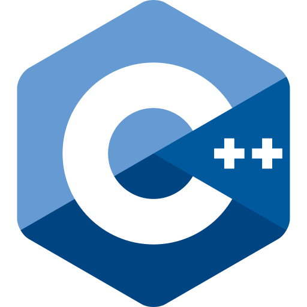

## Olá! Eu Sou o Silas Junior
# 👨‍💻 Silas Junior 

**`Estudando P/ Desenvolvedor FullStack`**

Meu nome é <b>Silas Figueredo da Silva Junior</b>, tenho 18 anos e sou natural de Teresina do Piauí📍. Concluí meu Ensino Médio no Instituto Federal do Piauí-(IFPI) integrado ao Técnico em Informática. Atualmente estou cursando em Sistemas Para Internet na Universidade Estadual do Piauí-(UESPI). Eu gosto muito da área de tecnologia💻, e gosto de sempre está aprendendo mais📚, e também sou músico!🎺🎶

    
    

---

### <'/Tecnologias'>

 
 

### 📊 Estatísticas

  

